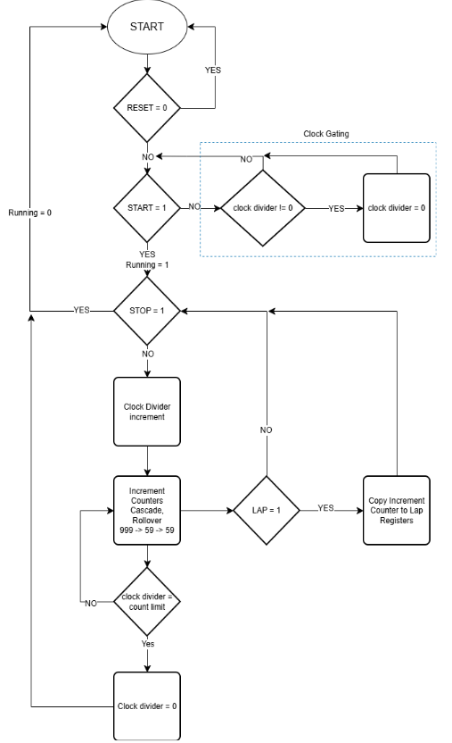
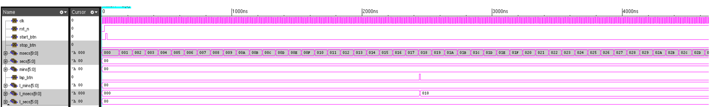
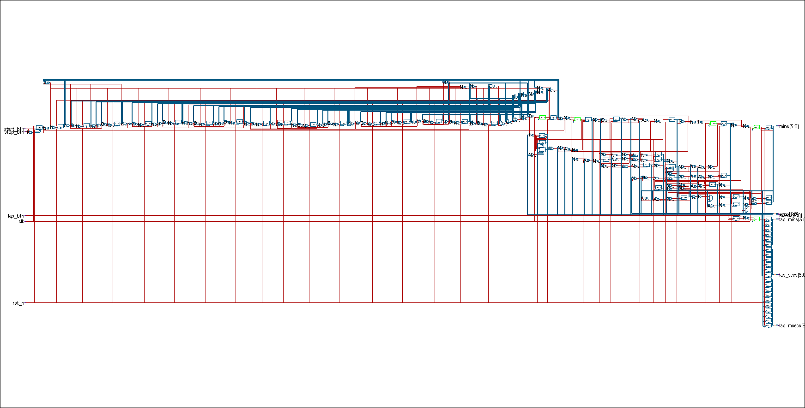
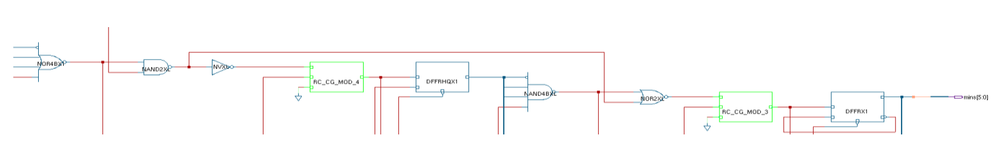

# Low-Power-VLSI-System
Dump of Cadence files for a low power VLSI timing system with ICG enabled
## Overview
A stopwatch digital design implemented using Verilog and taken through synthesis and physical design using Cadence Genus and Innovus.

## Design Flow

## Simulation Waveform

## RTL Schematic

## Post-Route Layout

## Clock Gating Inference

## Reports
- Area report
- Timing report
- Power report
- Worst setup timing report
